# Requirements and Specification Document

## Data Driven Logistics (DDL)

### Project Abstract

The goal of the Data Driven Logistics (DDL) is to develop a comprehensive web application designed for businesses to efficiently track inventory across multiple physical locations. This system aims to model business processes, transforming inputs into outputs, managing shipments, and maintaining precise inventory records. By implementing DDL, businesses can gain real-time visibility into inventory levels at any site and any given time, ensuring operational efficiency and informed decision-making.

### Customer

#### General Population

The primary customer base for the Data Driven Logistics (DDL) encompasses businesses within the manufacturing sector, with a special focus on automotive manufacturing. This demographic includes small to large-scale manufacturers that operate across multiple physical locations and require efficient, real-time tracking of inventory and production processes. Target customers include:

- **Manufacturing Plant Managers**: Individuals overseeing production and inventory across manufacturing sites.
- **Supply Chain Coordinators**: Professionals managing the logistics of material movements and production flow.
- **Inventory Specialists**: Staff responsible for tracking stock levels, managing shipments, and ensuring material availability.
- **Business Analysts**: Analysts looking to derive insights from inventory and process data to optimize operations.
- **IT and System Administrators**: Those managing system implementation, integration, and maintenance.

#### Specific Customers for This Document

The specific customers informing this document include:

- **CS506 Instructional Staff**: The instructional team of the CS506 course acts as the project's primary customer, providing initial requirements and guiding the development process to ensure the project meets both educational objectives and real-world applicability.
- **Student Developers**: The team of students undertaking the project, responsible for gathering requirements, designing, developing, and testing the DDL system.

#### Customer Engagement

The project engages both the instructional staff and student developers, ensuring a comprehensive understanding of the domain and potential user needs. This collaboration aims to shape the project's direction, with continued feedback and testing phases expected to refine the system further.

### User Requirements

The user requirements for the Data Driven Logistics (DDL) are organized around different user roles and system functionalities to ensure clarity and ease of understanding. Each requirement is designated a priority level (High, Medium, Low) to guide development focus and resource allocation.

#### General System Access

- **R1**: System access should be seamlessly integrated with the company's existing single sign-on (SSO) infrastructure, allowing users to log in with their current network credentials.
  - Priority: High
  - Status: Open

#### Inventory Management

- **R2**: Users must be able to view real-time inventory levels across all locations from a centralized dashboard.
  - Priority: High
  - Status: Open
- **R3**: The system must provide functionality for recording shipments, both incoming and outgoing, updating inventory quantities accordingly.
  - Priority: High
  - Status: Open
- **R4**: Users should have the ability to perform inventory adjustments and log reasons for these adjustments to maintain an audit trail.
  - Priority: Medium
  - Status: Open

#### Process Modeling

- **R5**: The system should allow users to model business processes that detail the transformation of inputs into outputs, relevant to the automotive manufacturing industry.
  - Priority: High
  - Status: Open
- **R6**: It should be possible to associate specific inventory items and quantities with each step in a modeled process.
  - Priority: Medium
  - Status: Open

#### Historical Data and Reporting

- **R7**: Users must be able to access historical inventory data to track changes over time and perform trend analysis.
  - Priority: Medium
  - Status: Open
- **R8**: The system should offer reporting tools, including the ability to generate custom reports based on specific criteria (e.g., time period, location).
  - Priority: Medium
  - Status: Open

#### Audit Trail and Security

- **R9**: Every update made to the inventory or process models must be logged with user identification to create a comprehensive audit trail.
  - Priority: High
  - Status: Open
- **R10**: Access control mechanisms must be in place to ensure users can only view and manipulate inventory and processes relevant to their role.
  - Priority: High
  - Status: Open

#### Extensions and Integrations

- **R11**: The system should support spreadsheet import and export functionalities for easy data manipulation and reporting.
  - Priority: Low
  - Status: Open
- **R12**: Integration with geospatial data visualization tools to enable location-based inventory tracking.
  - Priority: Low
  - Status: Open

These requirements serve as a foundational guide for the development and implementation of the DDL, ensuring it meets the needs of businesses in managing their inventory and production processes efficiently and effectively.

### Use Cases & User Stories

In alignment with the user requirements outlined previously, the following use cases and user stories detail key scenarios within the Data Driven Logistics (DDL). Each use case is derived from user stories, ensuring that every major scenario is represented and distinct in its contributions to the system's functionality. Use cases are categorized by priority: "Must Have," "Useful," or "Optional," to guide development focus towards the most critical features by the project deadline.

#### Use Case 1: Real-Time Inventory Tracking

- **Priority**: Must Have
- **User Story**:
  > As a plant manager, I want to view real-time inventory levels across all locations, so that I can make informed decisions about resource allocation and production planning.
- **Acceptance Test**:
  1. Log in to the system using existing network credentials.
  2. Navigate to the dashboard and select the "Inventory Levels" view.
  3. Verify that inventory levels for all locations are displayed in real-time.

#### Use Case 2: Record Shipments

- **Priority**: Must Have
- **User Story**:
  > As an inventory specialist, I need to record incoming and outgoing shipments, so that inventory quantities are accurately updated.
- **Acceptance Test**:
  1. Access the "Shipments" section from the main menu.
  2. Enter shipment details including type (incoming/outgoing), quantities, and items.
  3. Confirm the inventory levels are adjusted accordingly.

#### Use Case 3: Process Modeling

- **Priority**: Must Have
- **User Story**:
  > As a process engineer, I want to model our manufacturing processes in the system, showing how inputs are transformed into outputs, so we can optimize our operations.
- **Acceptance Test**:
  1. Create a new process model, detailing each step of the manufacturing process.
  2. Associate specific inventory items with each process step.
  3. Validate that the model accurately reflects the transformation process.

#### Use Case 4: Audit Trail

- **Priority**: Must Have
- **User Story**:
  > As a compliance officer, I need to see an audit trail of updates made to inventory and processes, so we can ensure data integrity and accountability.
- **Acceptance Test**:
  1. Navigate to the "Audit Log" section.
  2. Select a date range and review all changes, including who made the change and what was changed.
  3. Verify the accuracy of the log entries against known updates.

#### Use Case 5: Spreadsheet Import/Export

- **Priority**: Useful
- **User Story**:
  > As an inventory manager, I want to import inventory data from spreadsheets to quickly update the system and export data for reporting purposes.
- **Acceptance Test**:
  1. Access the "Data Management" section and select "Import."
  2. Upload a spreadsheet file with inventory data and complete the import process.
  3. Verify the inventory in the system is updated accordingly. Repeat the process for exporting data.

#### Use Case 6: Geospatial Data Visualizations

- **Priority**: Optional
- **User Story**:
  > As a supply chain coordinator, I would like to visualize inventory distribution and movements on a map, so I can optimize logistics and supply chain operations.
- **Acceptance Test**:
  1. Go to the "Inventory Map" section.
  2. Select parameters for visualization, including locations and inventory types.
  3. Review the map to ensure it accurately represents the current inventory distribution and movements.

Each use case includes specific acceptance tests to validate the implementation. These scenarios provide concrete examples that the customer will use to determine if the respective use case has been successfully implemented. The prioritization of use cases ensures that development efforts are aligned with the most critical functionalities required by the deadline.

### User Interface Requirements

The Data Driven Logistics (DDL) requires a user-friendly, efficient, and informative interface to facilitate seamless interaction between the users and the system's functionalities. The interface must cater to various user roles, including plant managers, inventory specialists, process engineers, and compliance officers, offering tailored views and functionalities to meet their specific needs. Below are detailed user interface requirements, complemented by conceptual illustrations.

#### Dashboard (Home Page)

- **Requirement**: The dashboard serves as the landing page after login, providing an overview of real-time inventory levels, recent shipments, and alerts for inventory shortages or discrepancies.
- **Details**: It should feature widgets or cards for quick access to different sections of the application, such as Inventory Management, Shipments, Process Modeling, and Audit Logs.
- **Illustration**: ``

#### Inventory Management

- **Requirement**: A detailed inventory view that lists all items across different locations, with functionalities to filter, search, and sort by various parameters (e.g., item name, location, quantity).
- **Details**: Each inventory item should display critical information, such as current quantity, minimum required quantity, and options for recording shipments or adjustments.
- **Illustration**: ``

#### Shipments Recording

- **Requirement**: A dedicated section for recording incoming and outgoing shipments, including forms to input shipment details such as item, quantity, source/destination, and date.
- **Details**: This section should allow bulk import of shipment data from spreadsheets and provide templates for download.
- **Illustration**: ``

#### Process Modeling

- **Requirement**: An interface for defining and editing manufacturing processes, where users can map out the steps involved in transforming inputs into outputs.
- **Details**: The interface should allow for the visual representation of process flows, with drag-and-drop functionality for adding new steps or inputs/outputs.
- **Illustration**: ``

#### Audit Log

- **Requirement**: A comprehensive audit log that records and displays all changes made within the system, including who made the change, what was changed, and when.
- **Details**: It should offer filtering options by date, user, and type of change, and export functionality for reporting purposes.
- **Illustration**: ``

#### Reporting and Export

- **Requirement**: Capabilities for generating custom reports based on selected criteria (e.g., inventory levels over time, shipment history) and exporting data in various formats (e.g., CSV, PDF).
- **Details**: Users should be able to save report configurations for future use and schedule automated report generation.
- **Illustration**: ``

#### User Interface Design Considerations

- **Responsiveness**: The UI must be responsive, ensuring usability across devices, including desktops, tablets, and smartphones.
- **Accessibility**: Design elements should adhere to accessibility standards, ensuring the system is usable for all users, including those with disabilities.
- **Intuitive Navigation**: The navigation structure should be intuitive, with a consistent layout and clear indications of active sections to facilitate easy movement between different parts of the application.

These user interface requirements and illustrations provide a conceptual overview of how the DDL will interact with its users, ensuring a workflow that is both efficient and user-friendly.

### Security Requirements

The Data Driven Logistics (DDL) requires stringent security measures to protect sensitive data, ensure user privacy, and maintain system integrity against potential threats. Given the system's role in managing inventory across multiple locations and modeling business processes, security is paramount to prevent unauthorized access, data breaches, and service disruptions. Here are the key security requirements for the DDL:

#### Authentication and Authorization

- **Requirement**: Implement robust authentication mechanisms to verify the identity of users before granting access to the system. Utilize role-based access control (RBAC) to ensure users are authorized to access only the resources relevant to their role within the organization.
- **Rationale**: To prevent unauthorized access and ensure users can only perform actions permitted by their role, protecting sensitive data and critical functionalities.

#### Data Encryption

- **Requirement**: All data transmitted between the client and server must be encrypted using industry-standard protocols such as TLS (Transport Layer Security). Additionally, sensitive data stored in the MySQL database, such as user credentials and personal information, should be encrypted at rest.
- **Rationale**: To protect data integrity and confidentiality during transmission and storage, and to safeguard against eavesdropping or data theft.

#### Audit Logging

- **Requirement**: Maintain detailed audit logs of all user actions within the system, including login attempts, data modifications, and system configuration changes. These logs should be immutable and stored securely.
- **Rationale**: To provide an audit trail for forensic analysis in case of a security incident, ensuring accountability and facilitating the identification of malicious activities.

#### Input Validation and Sanitization

- **Requirement**: Implement strict input validation and sanitization on all user inputs and API requests to prevent common vulnerabilities such as SQL injection, cross-site scripting (XSS), and command injection attacks.
- **Rationale**: To protect the system from malicious inputs that could lead to unauthorized data access, data corruption, or system compromise.

#### Denial-of-Service (DoS) Protection

- **Requirement**: Deploy measures to detect and mitigate denial-of-service attacks, ensuring the system remains available to legitimate users. Consider rate limiting, traffic analysis, and cloud-based DoS protection services.
- **Rationale**: To maintain system availability and reliability, preventing service disruptions caused by malicious traffic overload.

#### Privacy and Confidentiality

- **Requirement**: Adhere to relevant data protection regulations (such as GDPR, CCPA) concerning user data privacy and confidentiality. Implement policies for data minimization, purpose limitation, and user consent for data collection and processing.
- **Rationale**: To ensure compliance with legal requirements, protect user privacy, and maintain trust in the system's handling of personal and sensitive information.

#### Regular Security Assessments

- **Requirement**: Conduct regular security assessments, including vulnerability scanning, penetration testing, and code reviews, to identify and remediate potential security weaknesses.
- **Rationale**: To proactively discover and fix vulnerabilities, reducing the risk of exploitation and enhancing overall system security.

These security requirements are essential for safeguarding the DDL against various cyber threats, ensuring the protection of sensitive data, and maintaining user trust and system integrity. Implementing these measures will address potential vulnerabilities and compliance requirements, contributing to a secure and reliable inventory management system.

### System Requirements

The Data Driven Logistics (DDL) is designed to operate efficiently and securely within a specified technical environment. Below are the system requirements detailing the external entities, software dependencies, hardware requirements, and performance criteria essential for the successful deployment and operation of the system.

| Requirement Type     | Specification                       | Details                                                                                     |
| -------------------- | ----------------------------------- | ------------------------------------------------------------------------------------------- |
| **Operating System** | Cross-platform                      | Must support Linux, Windows, and macOS for server deployment.                               |
| **Web Server**       | Node.js with Express                | Express.js will serve as the web server and API backend, running on Node.js.                |
| **Database**         | MySQL                               | The system relies on MySQL for data storage, requiring MySQL Server 5.7 or newer.           |
| **Frontend**         | Web Browsers                        | Must be compatible with modern web browsers (Chrome, Firefox, Safari, Edge) supporting ES6. |
| **Development**      | Node.js                             | Required for backend development. Version 14.x or newer recommended.                        |
| **Dependencies**     | React, Node.js, MySQL drivers, etc. | Software libraries and frameworks specified in `package.json` for Node.js applications.     |
| **Performance**      | Response Time < 2 seconds           | For user interactions through the web interface under normal load conditions.               |
| **Backup**           | Daily backups                       | Automated backups of the database and critical data.                                        |
| **Security**         | TLS 1.2 or higher                   | For encrypting data in transit. HTTPS should be enforced for all web interactions.          |

These system requirements ensure that the DDL is built on a solid and scalable foundation, capable of handling the demands of modern inventory and process management within the specified technical environment. Proper adherence to these requirements will facilitate a seamless and efficient operation, ensuring reliability, security, and optimal performance of the system.

### Specification

<!--A detailed specification of the system. UML, or other diagrams, such as finite automata, or other appropriate specification formalisms, are encouraged over natural language.-->

<!--Include sections, for example, illustrating the database architecture (with, for example, an ERD).-->

<!--Included below are some sample diagrams, including some example tech stack diagrams.-->

You can make headings at different levels by writing `# Heading` with the number of `#` corresponding to the heading level (e.g. `## h2`).

#### Technology Stack

Given the project's requirements and the development team's expertise, we have chosen the MERN stack with MySQL for the Data Driven Logistics (DDL). Below is a diagram illustrating the components of our chosen technology stack:

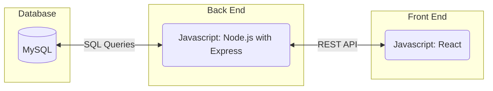

#### Database

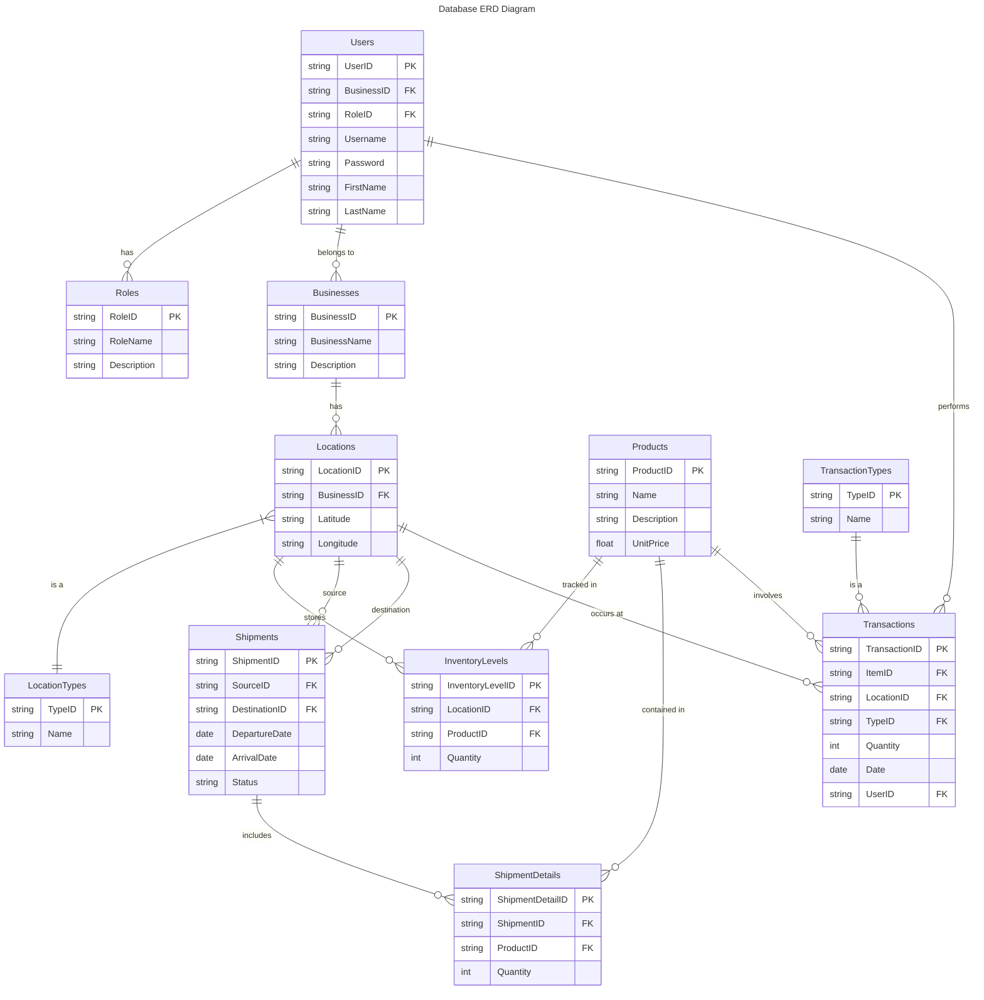

#### Class Diagram

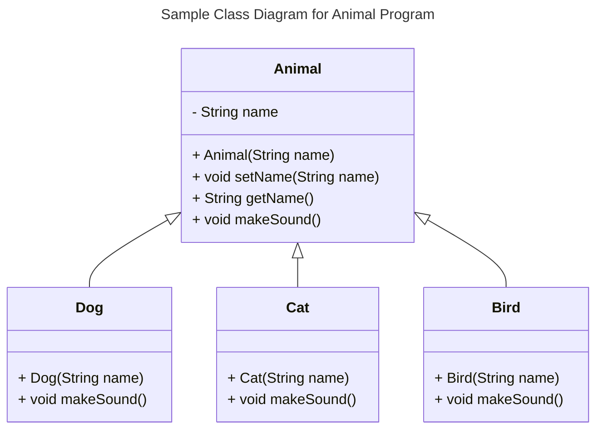

#### Flowchart

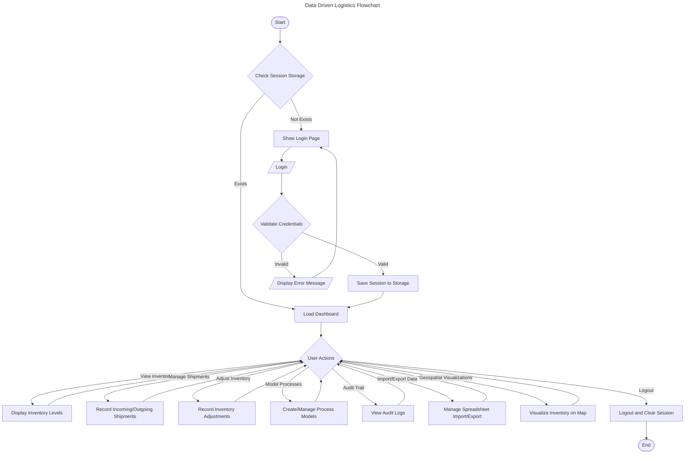

#### Behavior

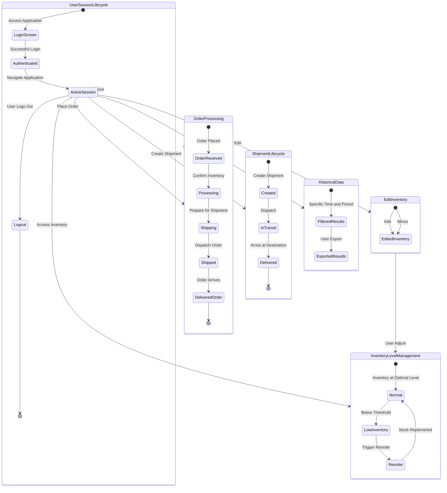

#### Sequence Diagram

##### System Overview

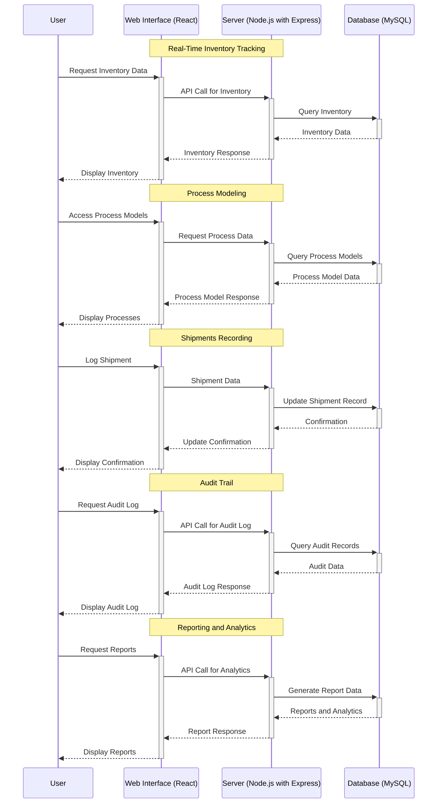

##### Real-Time Inventory Tracking System (RTIS)

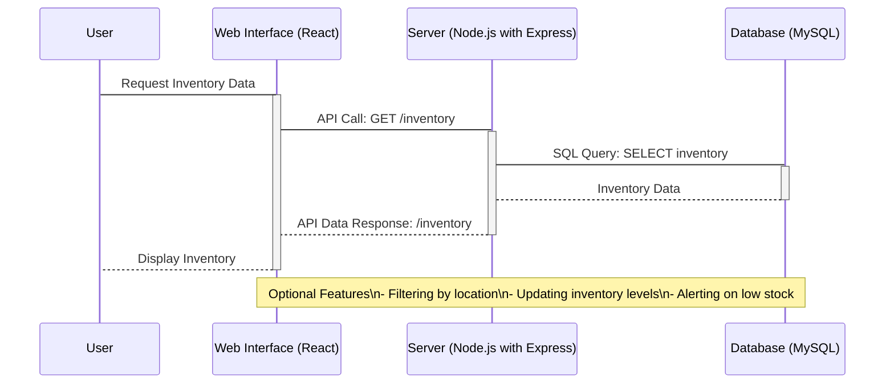
#### Process Modeling
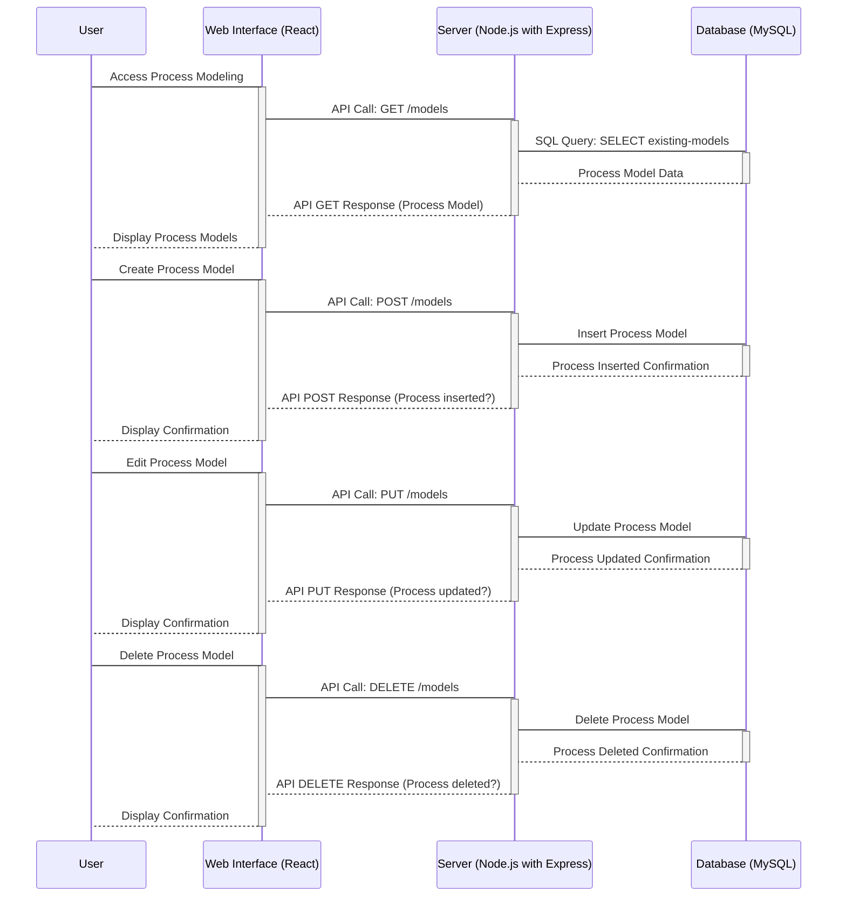

#### Shipments Recording
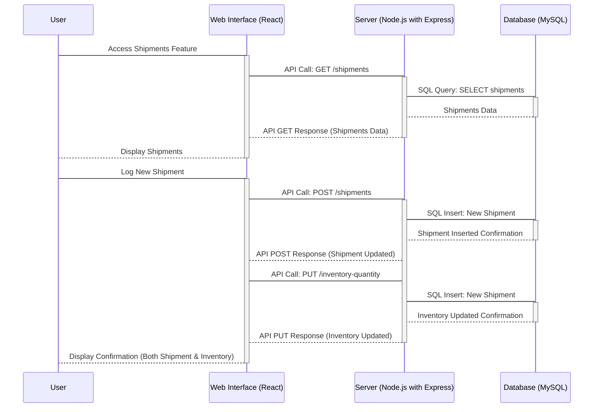

#### Audit Trail
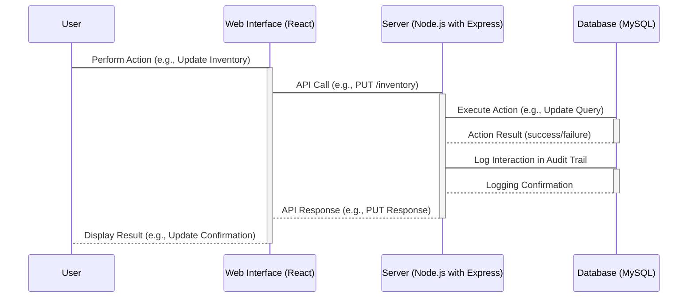

#### Reporting and Analytics
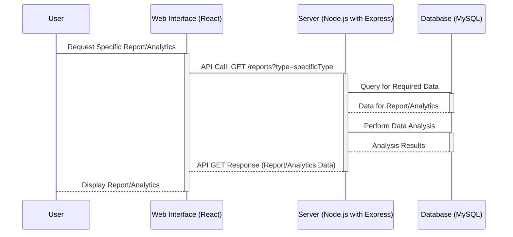

### Standards & Conventions

<!--Here you can document your coding standards and conventions. This includes decisions about naming, style guides, etc.-->
