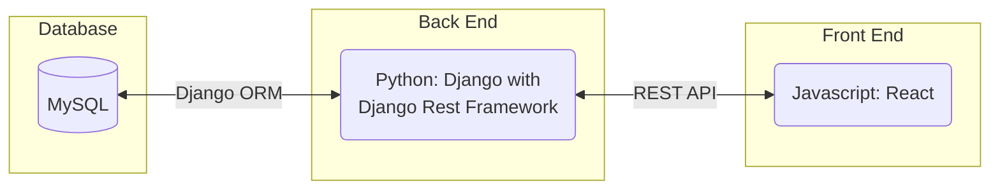
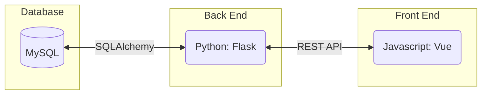
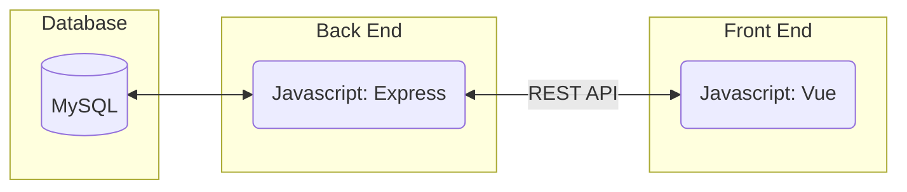
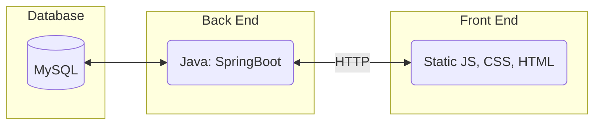
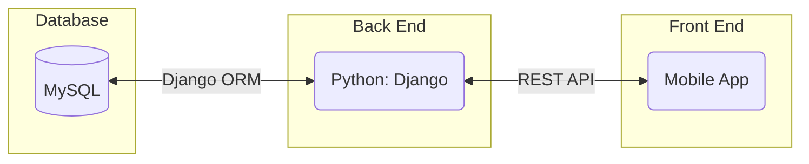
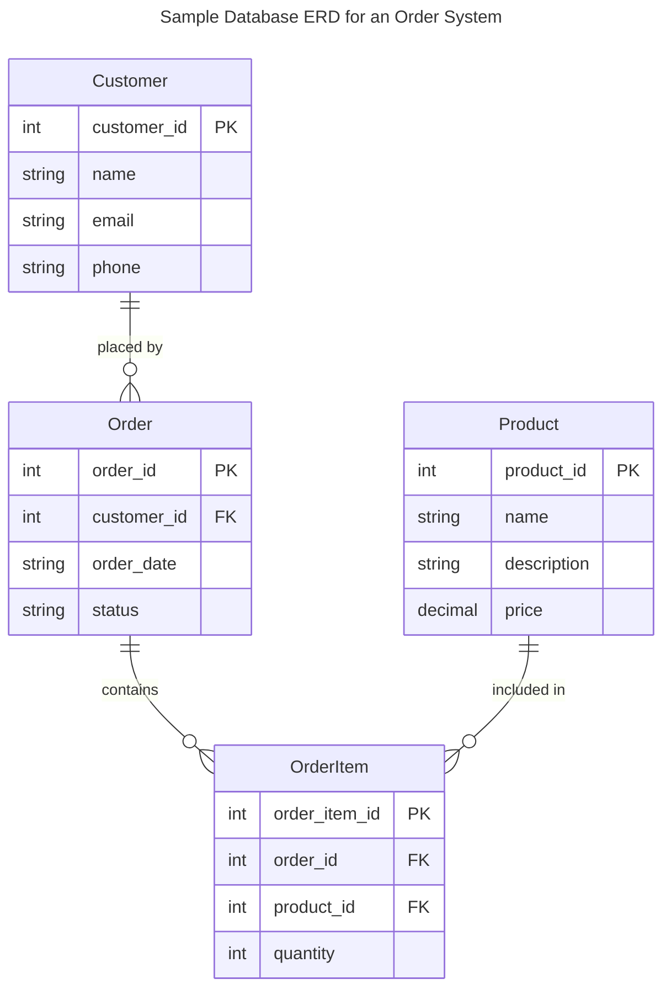
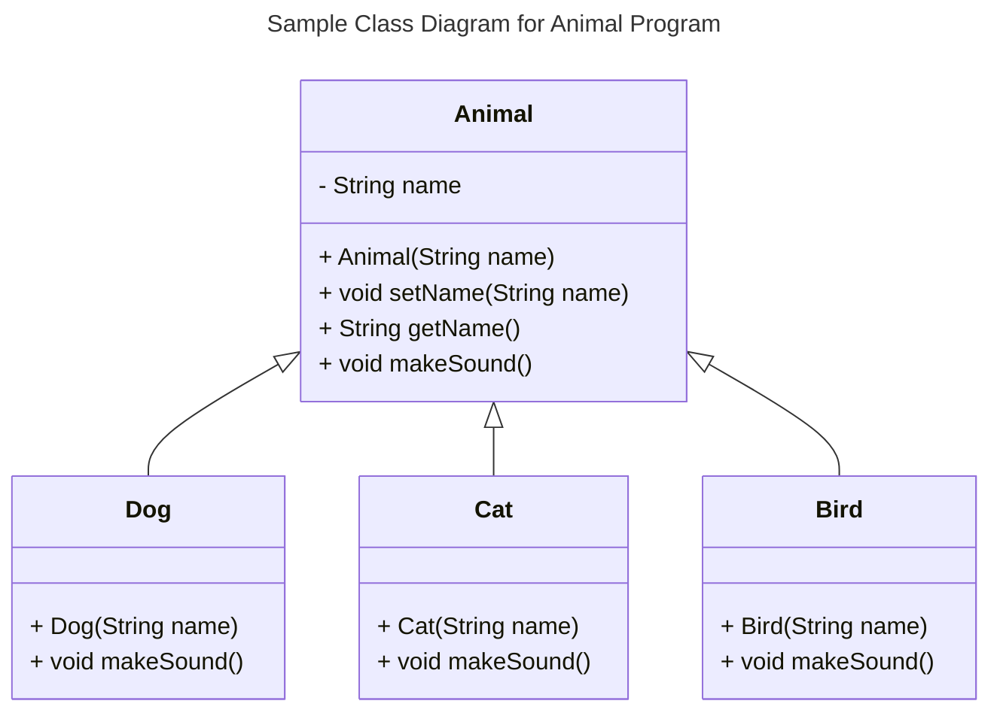
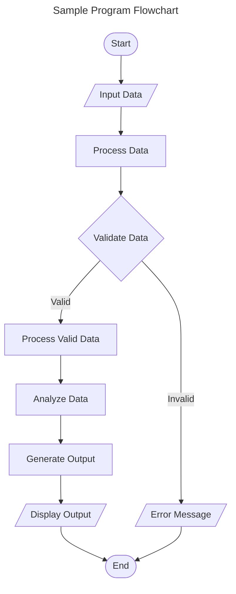
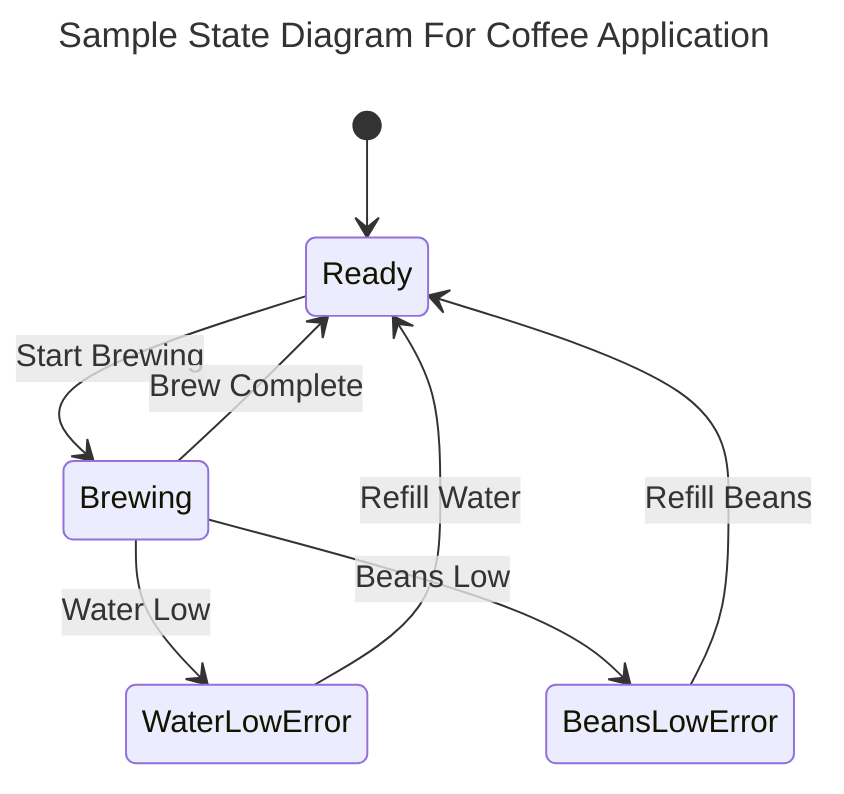
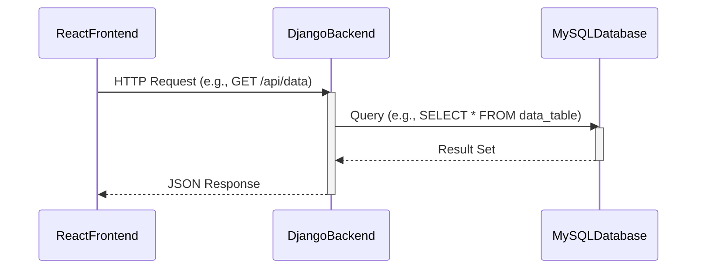

# Requirements and Specification Document

## Integrated Inventory and Process Management System (IIPMS)

### Project Abstract

The goal of the Integrated Inventory and Process Management System (IIPMS) is to develop a comprehensive web application designed for businesses to efficiently track inventory across multiple physical locations. This system aims to model business processes, transforming inputs into outputs, managing shipments, and maintaining precise inventory records. By implementing IIPMS, businesses can gain real-time visibility into inventory levels at any site and any given time, ensuring operational efficiency and informed decision-making.

### Customer

#### General Population

The primary customer base for the Integrated Inventory and Process Management System (IIPMS) encompasses businesses within the manufacturing sector, with a special focus on automotive manufacturing. This demographic includes small to large-scale manufacturers that operate across multiple physical locations and require efficient, real-time tracking of inventory and production processes. Target customers include:

- **Manufacturing Plant Managers**: Individuals overseeing production and inventory across manufacturing sites.
- **Supply Chain Coordinators**: Professionals managing the logistics of material movements and production flow.
- **Inventory Specialists**: Staff responsible for tracking stock levels, managing shipments, and ensuring material availability.
- **Business Analysts**: Analysts looking to derive insights from inventory and process data to optimize operations.
- **IT and System Administrators**: Those managing system implementation, integration, and maintenance.

#### Specific Customers for This Document

The specific customers informing this document include:

- **CS506 Instructional Staff**: The instructional team of the CS506 course acts as the project's primary customer, providing initial requirements and guiding the development process to ensure the project meets both educational objectives and real-world applicability.
- **Industry Consultants**: Experts in automotive manufacturing who have collaborated with the instructional staff to define specific industry needs and challenges, ensuring the system is tailored to address real operational inefficiencies.
- **Potential End-Users**: A select group of manufacturing plant managers and supply chain coordinators have been consulted to gather detailed user requirements and feedback, crucial for tailoring the system's functionalities to meet end-user expectations effectively.

#### Customer Engagement

The project engages a diverse group of customers, from instructional staff and industry consultants to potential end-users, ensuring a comprehensive understanding of the domain and user needs. This collaboration aims to shape the project's direction, with continued feedback and testing phases expected to refine the system further, fostering enthusiasm and readiness among the customers to utilize the IIPMS upon completion.

### User Requirements

The user requirements for the Integrated Inventory and Process Management System (IIPMS) are organized around different user roles and system functionalities to ensure clarity and ease of understanding. Each requirement is designated a priority level (High, Medium, Low) to guide development focus and resource allocation.

#### General System Access
- **R1**: System access should be seamlessly integrated with the company's existing single sign-on (SSO) infrastructure, allowing users to log in with their current network credentials. 
  - Priority: High
  - Status: Open

#### Inventory Management
- **R2**: Users must be able to view real-time inventory levels across all locations from a centralized dashboard.
  - Priority: High
  - Status: Open
- **R3**: The system must provide functionality for recording shipments, both incoming and outgoing, updating inventory quantities accordingly.
  - Priority: High
  - Status: Open
- **R4**: Users should have the ability to perform inventory adjustments and log reasons for these adjustments to maintain an audit trail.
  - Priority: Medium
  - Status: Open

#### Process Modeling
- **R5**: The system should allow users to model business processes that detail the transformation of inputs into outputs, relevant to the automotive manufacturing industry.
  - Priority: High
  - Status: Open
- **R6**: It should be possible to associate specific inventory items and quantities with each step in a modeled process.
  - Priority: Medium
  - Status: Open

#### Historical Data and Reporting
- **R7**: Users must be able to access historical inventory data to track changes over time and perform trend analysis.
  - Priority: Medium
  - Status: Open
- **R8**: The system should offer reporting tools, including the ability to generate custom reports based on specific criteria (e.g., time period, location).
  - Priority: Medium
  - Status: Open

#### Audit Trail and Security
- **R9**: Every update made to the inventory or process models must be logged with user identification to create a comprehensive audit trail.
  - Priority: High
  - Status: Open
- **R10**: Access control mechanisms must be in place to ensure users can only view and manipulate inventory and processes relevant to their role.
  - Priority: High
  - Status: Open

#### Extensions and Integrations
- **R11**: The system should support spreadsheet import and export functionalities for easy data manipulation and reporting.
  - Priority: Low
  - Status: Open
- **R12**: Integration with geospatial data visualization tools to enable location-based inventory tracking.
  - Priority: Low
  - Status: Open

These requirements serve as a foundational guide for the development and implementation of the IIPMS, ensuring it meets the needs of businesses in managing their inventory and production processes efficiently and effectively.

### Use Cases & User Stories

<!--Use cases and user stories that support the user requirements in the previous section. The use cases should be based off user stories. Every major scenario should be represented by a use case, and every use case should say something not already illustrated by the other use cases. Diagrams (such as sequence charts) are encouraged. Ask the customer what are the most important use cases to implement by the deadline. You can have a total ordering, or mark use cases with “must have,” “useful,” or “optional.” For each use case you may list one or more concrete acceptance tests (concrete scenarios that the customer will try to see if the use case is implemented).-->

Here is a sample user story from [Clean Agile](https://learning-oreilly-com.ezproxy.library.wisc.edu/library/view/clean-agile-back/9780135782002/ch03.xhtml#ch03lev1sec1) using a markdown block quote:

> As the driver of a car, in order to increase my velocity, I will press my foot harder on the accelerator pedal.

1. You
   1. Can
      1. Also
2. Use
   1. Numbered
      1. Lists

### User Interface Requirements

<!--Describes any customer user interface requirements including graphical user interface requirements as well as data exchange format requirements. This also should include necessary reporting and other forms of human readable input and output. This should focus on how the feature or product and user interact to create the desired workflow. Describing your intended interface as “easy” or “intuitive” will get you nowhere unless it is accompanied by details.-->

<!--NOTE: Please include illustrations or screenshots of what your user interface would look like -- even if they’re rough -- and interleave it with your description.-->

Images can be included with ``

### Security Requirements

<!--Discuss what security requirements are necessary and why. Are there privacy or confidentiality issues? Is your system vulnerable to denial-of-service attacks?-->

### System Requirements

<!--List here all of the external entities, other than users, on which your system will depend. For example, if your system inter-operates with sendmail, or if you will depend on Apache for the web server, or if you must target both Unix and Windows, list those requirements here. List also memory requirements, performance/speed requirements, data capacity requirements, if applicable.-->

| You    |    can    |    also |
| ------ | :-------: | ------: |
| change |    how    | columns |
| are    | justified |         |

### Specification

<!--A detailed specification of the system. UML, or other diagrams, such as finite automata, or other appropriate specification formalisms, are encouraged over natural language.-->

<!--Include sections, for example, illustrating the database architecture (with, for example, an ERD).-->

<!--Included below are some sample diagrams, including some example tech stack diagrams.-->

You can make headings at different levels by writing `# Heading` with the number of `#` corresponding to the heading level (e.g. `## h2`).

#### Technology Stack

Here are some sample technology stacks that you can use for inspiration:

#### Database

#### Class Diagram

#### Flowchart

#### Behavior

#### Sequence Diagram

### Standards & Conventions

<!--Here you can document your coding standards and conventions. This includes decisions about naming, style guides, etc.-->
